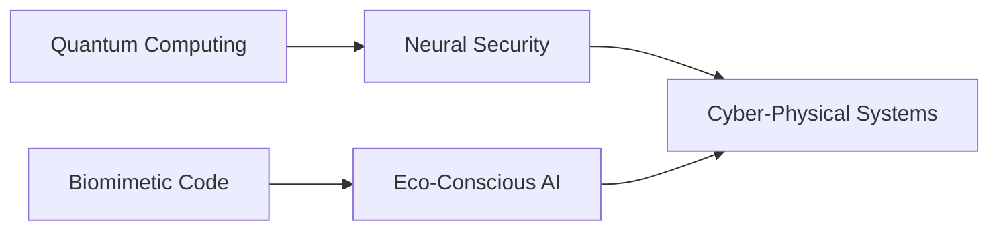

# <span style="font-family: 'Courier New', monospace; color: #00FF41">⎇ 𝕋𝕚𝕞𝕠𝕥𝕙𝕪𝕜𝕖'𝕤 ℂ𝕪𝕓𝕖𝕣 ℂ𝕠𝕣𝕖</span>
### <span style="font-family: 'Courier New', monospace; color: #FF00FF">≫≫ 𝙀𝙩𝙝𝙞𝙘𝙖𝙡 𝙃𝙖𝙘𝙠𝙚𝙧 | 𝙂𝙧𝙚𝙚𝙣 𝙏𝙚𝙘𝙝 𝙀𝙫𝙖𝙣𝙜𝙚𝙡𝙞𝙨𝙩 | 𝙌𝙪𝙖𝙣𝙩𝙪𝙢 𝘿𝙚𝙫𝙚𝙡𝙤𝙥𝙚𝙧 ≪≪</span>

<div align="center">


[](https://github.com/Timothyke)
[](https://github.com/Timothyke)
[](https://github.com/Timothyke)

</div>

## <span style="font-family: 'Courier New', monospace; color: #00FFFF">⫸⫸ 𝔻𝕚�𝕚�𝕒𝕝 𝕊𝕚𝕘𝕟𝕒𝕥𝕦𝕣𝕖 ⫷⫷</span>

```python
# CYBERPROFILE v3.14
class CyberTimothy:
    def __init__(self):
        self.codename = "Timothyke"
        self.specializations = [
            "Quantum-Resistant Cryptography",
            "Biomimetic Algorithms", 
            "Neural Security Frameworks"
        ]
        self.energy_profile = "Carbon-Negative"
        
    def current_mission(self):
        return "Developing ethical AI systems with ecological consciousness"
        
    def contact(self):
        return {
            'email': "⎈⎈⎈⎈⎈⎈⎈⎈⎈⎈⎈⎈⎈",  # Encrypted
            'matrix': "@timothyke:cyber.dimension"
        }
```

## <span style="font-family: 'Courier New', monospace; color: #FF00FF">⫸ 𝕃𝕚𝕧𝕖 ℙ𝕣𝕠𝕛𝕖𝕔𝕥 𝔽𝕖𝕖𝕕𝕤 ⫷</span>

<div align="center">

| PROJECT | STATUS | TECH STACK | ENERGY RATING |
|---------|--------|------------|---------------|
| **Supreme Octo** | `ACTIVE` |   | ♻️♻️♻️♻️ |
| **Nature-Hub** | `LIVE` |   | ♻️♻️♻️♻️♻️ |
| **EcoDNS** | `BETA` |   | ♻️♻️♻️♻️ |

</div>

## <span style="font-family: 'Courier New', monospace; color: #00FF41">⫸ 𝕋𝕖𝕔𝕙 ℕ𝕖𝕦𝕣𝕒𝕝 ℕ𝕖𝕥⫷</span>



## <span style="font-family: 'Courier New', monospace; color: #FF00FF">⫸ 𝔻𝕪𝕟𝕒𝕞𝕚𝕔 𝕊𝕪𝕤𝕥𝕖𝕞 𝕊𝕥𝕒𝕥𝕤 ⫷</span>

<div align="center">


</div>

## <span style="font-family: 'Courier New', monospace; color: #00FFFF">⫸ ℂ𝕪𝕓𝕖𝕣 ℂ𝕠𝕟𝕟𝕖𝕔𝕥 ⫷</span>

<div align="center">

[](mailto:timothymaina040@gmail.com)
[](https://www.linkedin.com/in/timothy-kageni)
[](https://matrix.to/#/@yourhandle:matrix.org)
[](https://signal.me/#p/+254794637463)

</div>

> <span style="font-family: 'Courier New', monospace; color: #FF00FF">"The future is here — it's just not evenly distributed yet."</span>  
> <span style="font-family: 'Courier New', monospace; color: #00FF41">- William Gibson</span>
```

