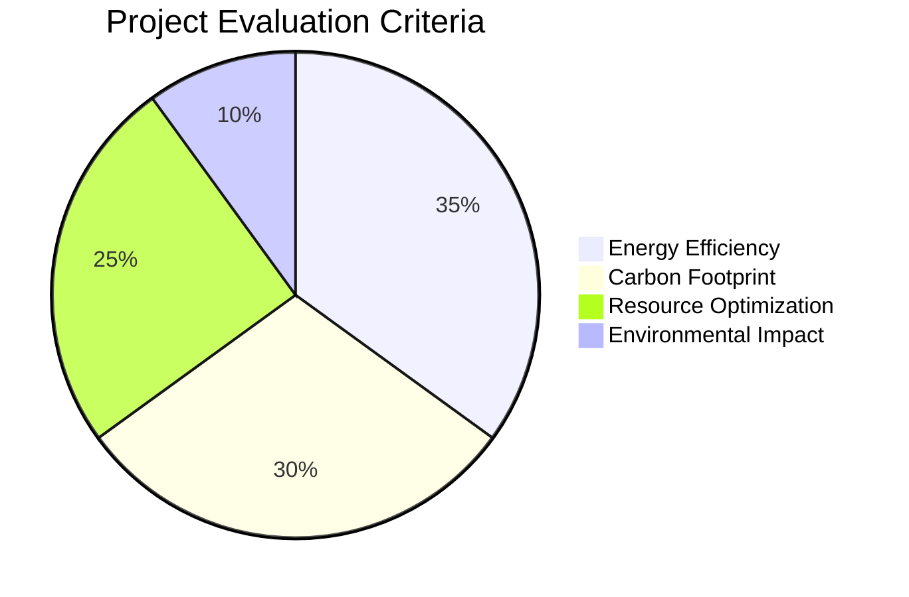

# 👋 Hello World! I'm Timothy Maina (Timothyke)

**🛠️ Full-Stack Developer | 🔐 Cybersecurity Specialist | 🌿 Sustainable Tech Innovator**

[](https://github.com/Timothyke)
[](https://github.com/Timothyke?tab=repositories)
[](https://github.com/Timothyke)

```python
#!/usr/bin/env python3
# -*- coding: utf-8 -*-

class TimothyMaina:
    def __init__(self):
        self.aliases = ["Timothyke", "CyberNature"]
        self.current_roles = [
            "Security Developer",
            "Green Tech Advocate",
            "Open Source Contributor"
        ]
        self.technical_stack = {
            'security': ["Ethical Hacking", "Cryptography", "OWASP Top 10"],
            'backend': ["Django", "Flask", "Node.js", "PostgreSQL"],
            'frontend': ["React", "TailwindCSS", "Three.js"],
            'devops': ["Docker", "AWS", "GitHub Actions"]
        }
    
    def current_projects(self):
        return [
            "Supreme Octo Bassoon - Advanced Security Framework",
            "Nature-Hub - Conservation Technology Platform",
            "EcoCode - Sustainable Development Tools"
        ]
    
    def contact(self):
        return {
            'email': "timothymaina040@gmail.com",
            'linkedin': "https://linkedin.com/in/timothy-kageni",
            'whatsapp': "+254 794 637 463"
        }

if __name__ == "__main__":
    me = TimothyMaina()
```

## 🔥 Featured Projects

### 🛡️ Supreme Octo Bassoon


- Advanced threat intelligence platform
- Collection of ethical hacking tools
- Regular security research updates

### 🌿 Nature-Hub


- Real-time wildlife monitoring system
- Environmental education portal
- Sustainable web development showcase

## 🚀 Tech Stack

<div align="center">
  
| Category       | Technologies                                                                 |
|----------------|-----------------------------------------------------------------------------|
| **Security**   |    |
| **Backend**    |    |
| **Frontend**   |    |
| **DevOps**     |    |

</div>

## 📊 GitHub Metrics

<div align="center">
  


</div>

## 🌱 Sustainability Commitment



## 📬 Let's Connect

<div align="center">

[](mailto:timothymaina040@gmail.com)
[](https://www.linkedin.com/in/timothy-kageni)
[](https://wa.me/254794637463)
[](https://twitter.com/yourhandle)

</div>

## 💭 Developer Philosophy

> "The art of programming is the art of organizing complexity, of mastering multitude and avoiding its bastard chaos as effectively as possible."
> *- Edsger W. Dijkstra*

*Combined with:*
> "We won't have a society if we destroy the environment."
> *- Margaret Mead*

*Let's build secure, sustainable technology for tomorrow.*
```

