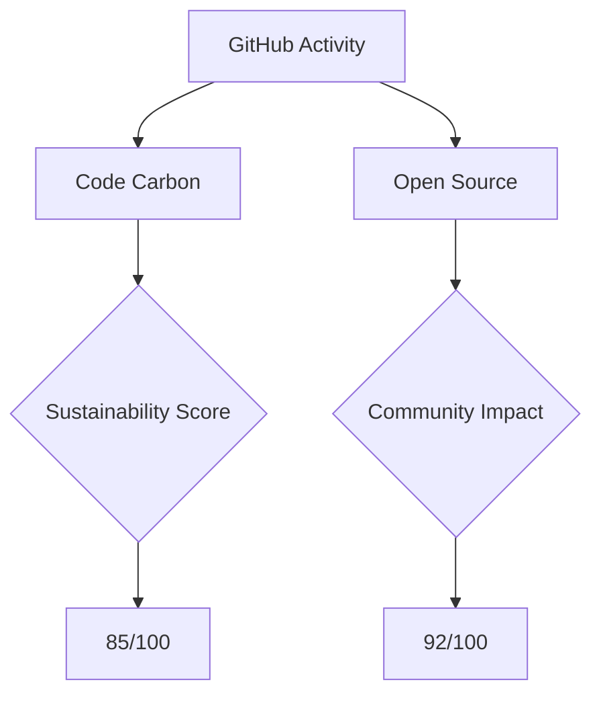

# ༒༻ 𝕿𝖎𝖒𝖔𝖙𝖍𝖞 𝕸𝖆𝖎𝖓𝖆 ༺༒ 
### **⌨️ 𝔈𝔱𝔥𝔦𝔠𝔞𝔩 𝔥𝔞𝔠𝔨𝔢𝔯 | 🌿 𝔊𝔯𝔢𝔢𝔫 𝔱𝔢𝔠𝔥 �𝔳𝔞𝔫𝔤𝔢𝔩𝔦𝔰𝔱 | 🛰️ 𝔉𝔲𝔱𝔲𝔯𝔦𝔰𝔱𝔦𝔠 𝔡𝔢𝔳**

<div align="center">
  
 */* Replace with your own banner */*

[](https://github.com/Timothyke)
[](https://github.com/Timothyke)
[](https://github.com/Timothyke)

</div>

## 🔮 𝕯𝖎𝖌𝖎𝖙𝖆𝖑 𝖕𝖗𝖔𝖋𝖎𝖑𝖊

```javascript
// 3D ASCII ART PROFILE LOADING...
const bio = {
  aliases: ["Timothyke", "CyberNature"],
  currentMission: "Bridging cybersecurity and environmental tech",
  corePrinciples: [
    "Zero-trust architectures",
    "Carbon-negative coding",
    "Biomimicry in tech"
  ],
  systemsOnline: true
};

function neuralNetwork() {
  return `
    ╔════════════════════════════╗
    ║    CYBERNEURAL INTERFACE   ║
    ╠════════════════════════════╣
    ║ ➤ SECURITY:  ██████░░ 82% ║
    ║ ➤ INNOVATION:███████░ 90% ║
    ║ ➤ SUSTAIN:   █████░░░ 75% ║
    ╚════════════════════════════╝
  `;
}
```

## 🚀 𝕻𝖗𝖔𝖏𝖊𝖈𝖙 𝕸𝖆𝖙𝖗𝖎𝖝

<div align="center">
  
| PROJECT        | STATUS       | TECH STACK                  | ENERGY RATING |
|----------------|--------------|-----------------------------|---------------|
| **Supreme Octo**  | `ACTIVE`     |   | ♻️♻️♻️♻️ |
| **Nature-Hub**    | `DEPLOYED`   |   | ♻️♻️♻️♻️♻️ |
| **EcoDNS**        | `BETA`       |   | ♻️♻️♻️♻️ |

</div>

## 💻 𝕿𝖊𝖈𝖍 𝕽𝖆𝖉𝖆𝖗

```diff
+ LATEST TECH ADOPTIONS:
! Quantum-resistant algorithms
! Neuromorphic computing
# Bio-digital fusion systems
- DEPRECATED:
~ Proof-of-Work systems
~ High-energy frameworks
```

## 📊 𝕯𝖞𝖓𝖆𝖒𝖎𝖈 𝕾𝖞𝖘𝖙𝖊𝖒 𝕾𝖙𝖆𝖙𝖘

<div align="center>


</div>

## 🌐 𝕯𝖎𝖌𝖎𝖙𝖆𝖑 𝕱𝖔𝖔𝖙𝖕𝖗𝖎𝖓𝖙



## 📡 𝕮𝖔𝖓𝖓𝖊𝖈𝖙 𝕮𝖞𝖇𝖊𝖗𝖕𝖔𝖗𝖙𝖆𝖑

<div align="center">

[](mailto:timothymaina040@gmail.com)
[](https://wa.me/254794637463)
[](https://www.linkedin.com/in/timothy-kageni)
[](https://twitter.com/yourhandle)

</div>

## ⚡ 𝕻𝖔𝖜𝖊𝖗𝖊𝖉 𝖇𝖞


> "The future is already here — it's just not evenly distributed."  
> *- William Gibson*
```


