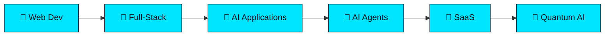

<div align="center">
  
  

  

  <br/>

  [](https://github.com/Timothyke)
  [](https://github.com/Timothyke)

  <br/><br/>

  > ### 🌳 *"I don't just write code. I build useful products, intelligent systems, and solutions to real problems."*

  <br/>

  
  
  
  

  <br/><br/>

  <a href="#-about-me">🌿 About</a> ·
  <a href="#-tech-stack">🌲 Tech</a> ·
  <a href="#-projects">🌳 Projects</a> ·
  <a href="#-ai-research-log">🔬 Research</a> ·
  <a href="#-github-statistics">📊 Stats</a> ·
  <a href="#-mission-roadmap-2026">🎯 Roadmap</a> ·
  <a href="#-lets-connect">🌱 Connect</a>

  <br/><br/>

  

</div>

<br/>

## 🌿 About Me


I'm a full-stack developer turned AI engineer, based in Nairobi. I started by building real sites for real Nairobi businesses, and most of what I know came from that hands-on work (and the bugs that came with it). From there I moved into AI engineering — agent workflows, LLM-powered apps, and automation built on top of that foundation.

### 🌲 Currently Learning
- 🌿 Agentic AI workflows and multi-step LLM pipelines
- 🌳 Practical RAG and prompt engineering
- 🌱 System design for production AI apps
- 🌲 Ethical, authorized security lab practice
- 🍃 Quantum computing / Quantum AI (early research)

### 🌳 How I Work
- 🌿 Learn by building, not just reading
- 🌲 Ship small, break it, fix it
- 🌱 Take on real client requirements over toy projects
- 🍃 Iterate in public, improve every round

<details>
<summary><b>🌲 Where I'm headed next</b></summary>
<br/>

Working toward launching my own SaaS products, contributing to open source, and going deeper into AI agent development — while continuing cybersecurity and quantum AI as long-term research interests rather than current specializations.

</details>

<br/>


## 🌲 Tech Stack

### 🌿 Frontend


### 🌳 Backend


### 🌱 Databases


### 🍃 AI Engineering


### 🌲 Security & Networking


### 🎋 Tools


<br/>


## 🌳 Projects

<div align="center">

| Project | Status | Description |
|---------|--------|-------------|
| 🤖 **MainAI** | 🚧 IN PROGRESS | AI assistant with agent workflows, long-term memory, and custom "Savanna" interface |
| 🖨️ **Nairobi Printing Studios** | ✅ LIVE | Digital platform for printing & branding business |
| 💻 **Tech Hub Digital** | ✅ LIVE | Digital-agency with dark glassmorphism UI |
| 🛒 **Techaccessories** | ✅ LIVE | WordPress ecommerce for live business |
| 🚗 **DriveKenya** | 🚧 IN PROGRESS | Car-hire platform with booking workflow |
| 🧠 **Next Build** | 🔬 EXPLORING | AI agents, automation, SaaS experiments |

</div>

### 🌿 Featured Project: MainAI

```
┌─────────────────────────────────────────────────────────────┐
│  🌳 MAINAI - AI Assistant for the Modern Developer         │
│                                                             │
│  🤖 Agentic AI workflows                                   │
│  🧠 Long-term conversational memory                        │
│  🔍 Agent tracing & evaluation                            │
│  🌅 "Savanna at Golden Hour" interface                    │
│                                                             │
│  Status: 🚧 Building                                       │
└─────────────────────────────────────────────────────────────┘
```

<br/>


## 🔬 AI Research Log

| Area | Focus | Stage | 🌿 Growth |
|------|-------|-------|-----------|
| **Agentic AI** | Multi-step agent workflows, traced and evaluated | 🏗️ Building | 🌱🌱🌱 |
| **Cybersecurity** | Ethical security learning, authorized lab practice | 📖 Learning | 🌱🌱 |
| **Quantum AI** | Quantum computing concepts and early experimentation | 🔬 Early research | 🌱 |

<br/>

## 📊 GitHub Statistics

<div align="center">

  
  

  <br/>

  

  <br/>

  

  <br/><br/>

  

</div>

<br/>

## 🗺️ Growth Timeline



<br/>

## 🎯 Mission Roadmap 2026

<div align="center">

| Track | Status | 🌿 Progress |
|-------|--------|-------------|
| **AI Engineering** | 🟡 In Progress | ✅ Built production-ready AI agents · ⬜ Multi-agent design · ⬜ Open-source tooling |
| **SaaS Development** | 🔵 Next | ⬜ Launch a useful SaaS product · ⬜ Iterate on feedback |
| **System Design** | 🟡 In Progress | ⬜ Strengthen system-design fundamentals |
| **Open Source** | 🔵 Next | ⬜ Contribute to open-source projects |
| **Cybersecurity** | ⚪ Exploring | ⬜ Ethical, authorized lab practice |
| **Quantum AI** | ⚪ Exploring | ⬜ Quantum computing & Quantum AI research |

</div>

<br/>


## 🌱 Developer Philosophy

```javascript
const mission = async () => {
  while (alive) {
    await plant();     // 🌱 Start new projects
    await grow();      // 🌿 Learn and expand
    await branch();    // 🌳 Explore new directions
    await flourish();  // 🌲 Ship and improve
    await harvest();   // 🍃 Share and contribute
  }
};
mission();
```

<div align="center">

```ascii
        🌳
       🌿🌿
      🌱  🌱
     🌲    🌲
    🍃      🍃
   🌿        🌿
  🌳          🌳
 🌲            🌲
🌱              🌱
```

</div>

<br/>

## 🤝 Let's Connect

<div align="center">

[](mailto:timothymaina030@gmail.com)
[](https://github.com/Timothyke)
[](https://linkedin.com/in/timothy-kageni)
[](https://twitter.com/timothyke)

<br/><br/>

**🌿 Most of my skills came from building projects that broke... then learning how to fix them.**

**🌳 The forest grows one tree at a time. The code ships one commit at a time.**

<br/>

⭐ Thanks for visiting. The next project is already loading.

<br/>


</div>
